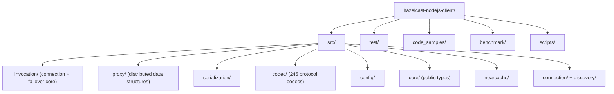
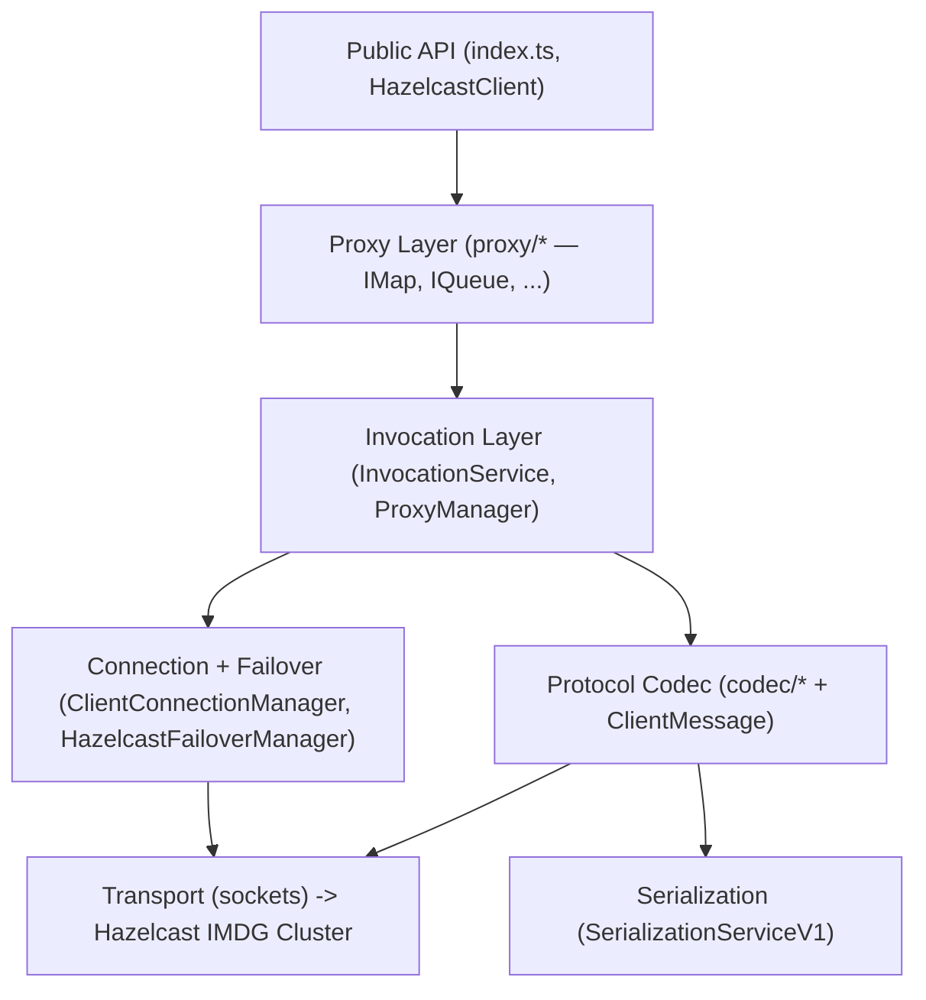
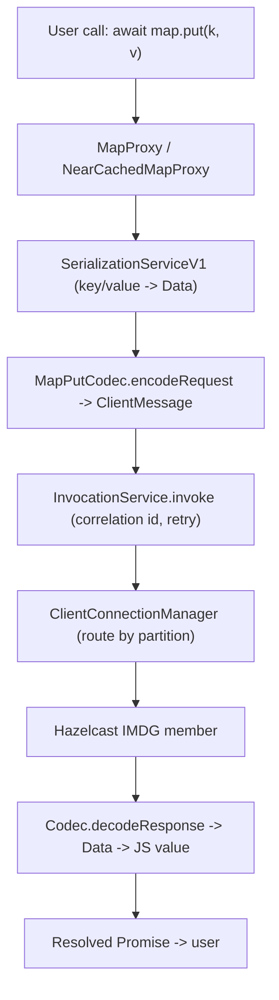
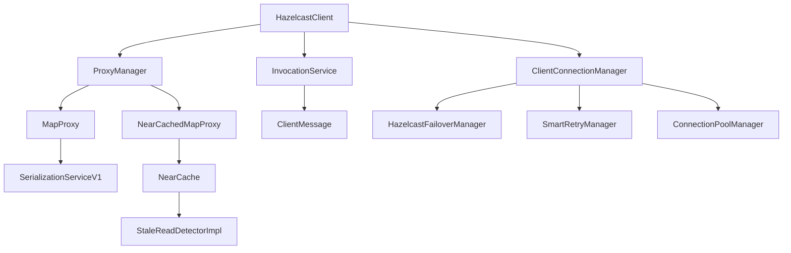

<!-- Generated: 2026-06-11 -->
<!-- Regenerate: run /csdlc-map and choose "Regenerate" -->

# Codebase Map — @celerispay/hazelcast-client

> **Project context document.** Load this file at the start of any session for immediate project orientation. Contains stack, conventions, architecture, data flow, and key patterns — no pipeline required.

---

## Project Summary

This is a **fork of the Hazelcast Node.js client** (`@celerispay/hazelcast-client`, v3.12.7-6) — a TypeScript client library for the Hazelcast IMDG (In-Memory Data Grid) 3.x. It provides a Promise-based API for connecting to a Hazelcast cluster and accessing distributed data structures (Map, Set, Queue, MultiMap, Topic, FlakeIdGenerator, PNCounter, AtomicLong, Lock, Semaphore, Ringbuffer) plus client-side Near Cache. The fork's defining purpose is a set of **critical connection failover and reconnection fixes** maintained by CelerisPay on top of upstream Hazelcast 3.12.5 — eliminating Invalid Credentials errors, connection explosion, and near-cache crashes during node failover so the client behaves like the Java client. It is consumed by backend Node.js services that need a resilient distributed cache/data-grid client.

**Status:** active maintenance fork (patch series 3.12.5-1 → 3.12.7-6, ongoing failover hardening)
**Type:** library (npm package, compiled TS → CommonJS)

---

## Quick Start

```bash
# Install dependencies
npm install

# Compile TypeScript -> lib/ (CommonJS, ES5 target)
npm run compile        # alias: npm run build

# Lint (TSLint against tsconfig.json)
npm run lint

# Test (downloads hazelcast-remote-controller + IMDG via Maven first, then mocha)
npm test

# Coverage (istanbul over lib/)
npm run coverage

# Generate API docs (typedoc, excludes codec/)
npm run generate-docs
```

**Prerequisites:** Node.js (devDeps pin `@types/node@8.0.0`), TypeScript `2.8.4`. Running the test suite requires **Java 8+** and **Maven** (the `pretest` hook runs `download-remote-controller.js` to fetch a live Hazelcast IMDG server + remote controller). A reachable Hazelcast IMDG 3.x cluster (default `127.0.0.1:5701`) is needed at runtime — start one with `docker run -p 5701:5701 hazelcast/hazelcast:3.12.6`.

---

## Tech Stack

| Layer | Technology |
|-------|-----------|
| Language | TypeScript 2.8.4 (compiles to ES5 / CommonJS) |
| Framework | None — standalone client library |
| Runtime | Node.js (typed against `@types/node@8.0.0`) |
| Database | N/A — IS a client for Hazelcast IMDG 3.x in-memory data grid |
| Test framework | Mocha 3.2.0 + Sinon 4.0.0 + `assert` |
| Linter / formatter | TSLint 5.7.0 (`tslint.json`) |
| Build tool | `tsc` (output to `lib/`) |
| Package manager | npm |
| Coverage | istanbul + remap-istanbul (cobertura + html) |
| Docs | typedoc 0.16.11 |

**Key runtime dependencies:**
- `bluebird@^3.7.2` — Promise implementation used pervasively (imported as `import * as Promise from 'bluebird'`)
- `long@^4.0.0` — 64-bit integer support (Hazelcast protocol uses 64-bit IDs/sequences)
- `safe-buffer@^5.2.1` — safe Buffer allocation for binary protocol framing

**Key dev dependencies:**
- `mocha@3.2.0` — test runner (junit reporter -> report.xml)
- `sinon@4.0.0` — mocks/stubs/spies
- `tslint@5.7.0` — linting
- `typescript@2.8.4` — compiler (pinned old version)
- `typedoc@^0.16.11` — API doc generation
- `@types/bluebird`, `@types/long`, `@types/node@8.0.0` — type definitions

---

## Directory Structure



**Directory roles:**

| Directory | Classification | Contents |
|-----------|---------------|---------|
| `src/` | source | All TypeScript source (406 `.ts` files) |
| `src/invocation/` | source | Connection management, failover services, cluster service, invocation pipeline — the most heavily modified area in this fork |
| `src/proxy/` | source | Client-side proxies for each distributed data structure (Map, Set, Queue, etc.) |
| `src/codec/` | source | 245 auto-style protocol codecs (request/response message encode/decode) |
| `src/serialization/` | source | Serialization service, portable serialization, identified data serializable |
| `src/config/` | source | Client/network/near-cache/SSL config classes + JSON config loading + Properties |
| `src/core/` | source | Public-facing types: Predicate, Member, listeners, EntryView, etc. |
| `src/nearcache/` | source | Client-side near cache + stale-read detection (failover-hardened) |
| `src/connection/` | source | Address providers/translators, SSL options factories |
| `src/discovery/` | source | Hazelcast Cloud discovery + address translation |
| `src/logging/`, `src/statistics/`, `src/aggregation/`, `src/protocol/`, `src/util/` | source | Logging, client statistics, aggregators, protocol error codes, utilities |
| `test/` | tests | 110 mocha test files (`*Test.js` run against compiled `lib/`) + RC.js remote-controller helper |
| `code_samples/` | docs | Runnable usage examples |
| `benchmark/`, `heapdump/` | scripts | Performance/benchmark and heap profiling scripts |
| `scripts/` | scripts | Build/release helper scripts |

---

## Architecture



**Layer responsibilities:**
- **Public API:** `src/index.ts` re-exports the surface (`Client`, `Config`, `Predicates`, `Aggregators`, errors). `src/HazelcastClient.ts` is the facade that wires every service together and exposes `getMap`, `getQueue`, lifecycle, etc.
- **Proxy Layer:** Each distributed structure has an interface (`IMap.ts`) and a proxy implementation (`MapProxy.ts`) extending `BaseProxy`/`PartitionSpecificProxy`. Proxies translate user calls into protocol messages and submit them to the invocation service. `NearCachedMapProxy.ts` layers near-cache reads on top.
- **Invocation Layer:** `InvocationService` sends `ClientMessage`s, correlates responses by id, applies retry policy; `ProxyManager` creates/caches proxies; `ListenerService`/`ClusterService` manage event registrations and membership.
- **Connection + Failover:** `ClientConnectionManager` owns the socket pool, health checks, and (re)connection. The fork adds dedicated failover collaborators: `HazelcastFailoverManager`, `ConnectionPoolManager`, `SmartRetryManager`, `CredentialPreservationService`, `NodeReadinessDetector`.
- **Protocol Codec:** `ClientMessage.ts` plus 245 generated codecs in `src/codec/` encode requests and decode responses for each cluster operation.
- **Serialization:** `SerializationServiceV1` converts JS objects ↔ binary `Data`; supports portable, identified data serializable, JSON, and default serializers.
- **Transport:** Raw TCP (optionally TLS via `connection/` SSL factories) to cluster members, with `PipelinedWriter`/`DirectWriter`/`FrameReader` (in `ClientConnection.ts`) handling framing.

---

## Data Flow



**Flow narrative:** A user calls a Promise-returning proxy method (e.g. `map.put`). The proxy serializes key/value to binary `Data`, encodes a `ClientMessage` via the matching codec, and hands it to `InvocationService`, which assigns a correlation id and routes it through `ClientConnectionManager` to the right cluster member (partition-aware in smart mode). The member's response is matched back by correlation id, decoded by the codec, deserialized, and used to resolve the Promise. On connection loss, the failover services (`HazelcastFailoverManager`, `SmartRetryManager`) decide whether to retry/reconnect/transfer ownership transparently.

---

## Module Map



**Modules:**
| Module / Package | Purpose | Key exports or files |
|-----------------|---------|-------------------|
| facade | Top-level client + public surface | `src/HazelcastClient.ts`, `src/index.ts`, `src/ClientInfo.ts` |
| invocation | Connection, failover, cluster, invocation | `ClientConnectionManager.ts`, `HazelcastFailoverManager.ts`, `InvocationService.ts`, `ClusterService.ts` |
| failover (fork additions) | Resilience collaborators | `SmartRetryManager.ts`, `ConnectionPoolManager.ts`, `CredentialPreservationService.ts`, `NodeReadinessDetector.ts` |
| proxy | Distributed data structures | `IMap.ts`/`MapProxy.ts`, `IQueue.ts`, `ISet.ts`, `MultiMap.ts`, `PNCounterProxy.ts`, `FlakeIdGeneratorProxy.ts`, `proxy/topic/`, `proxy/ringbuffer/` |
| serialization | Object <-> binary | `SerializationService.ts` (`SerializationServiceV1`), `ObjectData.ts`, `HeapData.ts`, `serialization/portable/` |
| codec | Protocol message codecs | `src/codec/*` (245 files), `ClientMessage.ts`, `ListenerMessageCodec.ts` |
| config | Configuration model + loading | `config/Config.ts` (`ClientConfig`), `ConfigBuilder.ts`, `Properties.ts`, `NearCacheConfig.ts`, `SSLConfig.ts` |
| core | Public domain types | `Predicate.ts`, `Member.ts`, `EntryListener.ts`, `MapListener.ts`, `HazelcastJsonValue.ts` |
| nearcache | Client-side cache | `NearCacheManager.ts`, `NearCache.ts`, `StaleReadDetectorImpl.ts`, `RepairingTask.ts` |
| discovery / connection | Address resolution + transport | `HazelcastCloudDiscovery.ts`, `DefaultAddressProvider.ts`, `BasicSSLOptionsFactory.ts` |
| logging / statistics | Observability | `logging/DefaultLogger.ts`, `logging/ILogger.ts`, `statistics/Statistics.ts` |

---

## Key Files

| File | Role | Notes |
|------|------|-------|
| `src/index.ts` | Public entrypoint | Re-exports `Client`, `Config`, `Predicates`, `Aggregators`, errors |
| `src/HazelcastClient.ts` | Client facade | `default export class HazelcastClient`; wires all services, `newHazelcastClient()` |
| `src/invocation/ClientConnectionManager.ts` | Connection pool + health | 833 lines; extends `EventEmitter`; health checks, cleanup, retry; failover-modified |
| `src/invocation/HazelcastFailoverManager.ts` | Failover orchestration | Owner/child disconnection handling, new-owner selection; fork addition |
| `src/invocation/SmartRetryManager.ts` | Error-aware retry | Classifies errors, computes retry delay/strategy per error type |
| `src/invocation/ConnectionPoolManager.ts` | Connection attempt throttling | Prevents connection explosion via attempt registration/dedup |
| `src/invocation/CredentialPreservationService.ts` | UUID/credential cache | Preserves/restores per-node creds across reconnects (Invalid Credentials fix) |
| `src/invocation/NodeReadinessDetector.ts` | Node readiness gating | Tracks failures to avoid premature reconnection |
| `src/invocation/ClusterService.ts` | Membership + partitions | 1169 lines — largest file; recent churn; member list, listeners |
| `src/invocation/InvocationService.ts` | Request/response pipeline | `Invocation` + `InvocationService`; correlation, retry, timeout |
| `src/proxy/MapProxy.ts` | IMap implementation | 708 lines; core distributed-map operations |
| `src/nearcache/StaleReadDetectorImpl.ts` | Near-cache safety | Null-guarded during failover (crash fix) |
| `src/serialization/SerializationService.ts` | Serialization | `SerializationServiceV1 implements SerializationService` |
| `src/config/Config.ts` | Config model | `ClientConfig`, network/serialization/near-cache config |
| `src/config/Properties.ts` | Property keys | `hazelcast.client.*` tunables, including fork failover knobs |
| `config-schema.json`, `hazelcast-client-default.json`, `hazelcast-client-full.json` | Config | JSON declarative config schema + samples |
| `download-remote-controller.js` | Test bootstrap | `pretest`/`precoverage` hook — downloads IMDG + RC via Maven |
| `test/ConnectionFailoverTest.js` | Tests | Failover-specific test for the fork's fixes |
| `FAILOVER_FIXES.md`, `HAZELCAST_CLIENT_EVOLUTION.md` | Docs | Detailed rationale + timeline of the fork's failover changes |

---

## Conventions & Patterns

These are the patterns observed in the codebase. Follow them when writing new code.

**Naming:**
- Files: `PascalCase.ts` for classes/types (`MapProxy.ts`, `HazelcastClient.ts`) — one primary class per file
- Classes/types/interfaces: `PascalCase`; public structure interfaces prefixed with `I` (`IMap`, `IQueue`, `ILogger`, `IAtomicLong`)
- Functions/methods: `camelCase`
- Property-key constants: dotted string literals `'hazelcast.client.*'`
- Tests: `*Test.js` (compiled JS, mirror the `src` area, e.g. `test/connection/`, `test/map/`)

**Architecture patterns:**
- **Proxy pattern:** every distributed structure = interface (`IMap`) + proxy (`MapProxy extends BaseProxy`), created and cached by `ProxyManager`. Add new structures by following this pair.
- **Codec pattern:** every cluster operation has a dedicated codec in `src/codec/` exposing `encodeRequest`/`decodeResponse` over `ClientMessage` — do not hand-build messages.
- **Service collaborators on the connection manager:** failover concerns are isolated into single-responsibility services (`SmartRetryManager`, `ConnectionPoolManager`, `CredentialPreservationService`, `NodeReadinessDetector`) injected with a logger — extend resilience by adding a new collaborator, not by bloating `ClientConnectionManager`.
- **EventEmitter** for connection/cluster lifecycle (`ClientConnectionManager extends EventEmitter`).

**Code style observations:**
- Async: **bluebird Promises** throughout (`import * as Promise from 'bluebird'`) — not native async/await. Return `Promise<T>` from proxy methods.
- Error handling: typed Hazelcast errors (`src/HazelcastError.ts`, `src/protocol/ErrorFactory.ts`, `ClientProtocolErrorCodes.ts`); failover code uses defensive try/catch with safe fallbacks (e.g. treat near-cache record as stale on any error).
- Logging: pluggable `ILogger` (`logging/ILogger.ts`, `DefaultLogger.ts`) injected into services — never `console.log`.
- Licensing: every source file begins with the Apache 2.0 copyright header — preserve it on new files.
- 64-bit values use the `long` library, not JS numbers.

**Things to avoid** (anti-patterns seen or explicitly avoided):
- No native `async/await` in new code that must match existing bluebird-based control flow (mixing is inconsistent here).
- Do not assume metadata/partition services are present during failover — always null-guard (the documented crash class).
- Do not add reconnection logic that only "unblocks" an address without actually attempting a connection (the original incomplete-reconnection bug).
- Do not let connection attempts multiply unbounded — route through `ConnectionPoolManager`.

---

## Configuration & Environment

**Environment variables:**

| Variable | Purpose | Required | Default |
|----------|---------|---------|---------|
| `HAZELCAST_CLIENT_CONFIG` | Path to declarative JSON client config | No | none |
| `HAZELCAST_ENTERPRISE_KEY` | Hazelcast Enterprise license key (test/server setup) | No | none |
| `HZ_TYPE` | Hazelcast distribution type for test bootstrap | No | none |
| `SERVER_TYPE` | Server type selector for test remote controller | No | none |
| `SERVER_VERSION` | IMDG server version to download for tests | No | none |

(Values redacted by policy — names only.)

**Client tunable properties** (set via `config.properties[...]`, defined/used around `src/config/Properties.ts`):

| Property key | Purpose |
|--------------|--------|
| `hazelcast.client.connection.health.check.interval` | Connection health check cadence (fork) |
| `hazelcast.client.connection.max.retries` | Max connection retries (fork) |
| `hazelcast.client.connection.retry.delay` | Delay between connection retries (fork) |
| `hazelcast.client.failover.cooldown` | Cooldown before failover re-evaluation (fork) |
| `hazelcast.client.partition.refresh.min.interval` | Min interval between partition refreshes (fork) |
| `hazelcast.client.partition.failure.backoff` | Backoff after partition op failure (fork) |
| `hazelcast.client.heartbeat.interval` / `.timeout` | Heartbeat cadence and timeout |
| `hazelcast.client.invocation.timeout.millis` | Invocation timeout |
| `hazelcast.client.invocation.max.retries` / `.retry.pause.millis` | Invocation retry policy |
| `hazelcast.client.statistics.enabled` / `.period.seconds` | Client statistics reporting |
| `hazelcast.client.autopipelining.enabled` / `.threshold.bytes` | Socket write auto-pipelining |
| `hazelcast.client.cloud.url` | Hazelcast Cloud discovery URL |
| `hazelcast.client.socket.no.delay` | TCP_NODELAY toggle |
| `hazelcast.client.internal.clean.resources.millis` | Internal resource cleanup interval |

**Config files:**
| File | Purpose |
|------|--------|
| `config-schema.json` | JSON schema for declarative client config |
| `hazelcast-client-default.json` | Minimal default declarative config sample |
| `hazelcast-client-full.json` | Fully-populated declarative config sample |
| `tsconfig.json` | TS compiler (module commonjs, target es5, outDir lib) |
| `tslint.json` | Lint rules |

---

## External Integrations

| Service | Type | Purpose | Config key |
|---------|------|---------|-----------|
| Hazelcast IMDG 3.x cluster | Data grid | Primary backend — all data operations target cluster members | `networkConfig.addresses`, default `127.0.0.1:5701` |
| Hazelcast Cloud | Discovery | Resolves cluster addresses for managed clusters | `hazelcast.client.cloud.url`, `discovery/HazelcastCloudDiscovery.ts` |
| hazelcast-remote-controller | Test infra | Controls IMDG members during the mocha suite | `download-remote-controller.js`, `test/RC.js` |
| Maven (Java 8+) | Build/test tooling | Downloads IMDG server + remote controller jars for tests | invoked by `download-remote-controller.js` |
| TLS/SSL | Transport security | Optional encrypted cluster connections | `config/SSLConfig.ts`, `connection/BasicSSLOptionsFactory.ts` |

---

## Test Strategy

- **Framework:** Mocha 3.2.0 with Sinon 4.0.0 and Node `assert`
- **Test location:** `test/` directory, `*Test.js` files (run against compiled `lib/`, organized into subdirs mirroring `src` areas: `connection/`, `map/`, `nearcache/`, `serialization/`, `discovery/`, etc.) — ~110 files
- **Run command:** `npm test` (junit reporter -> `report.xml`)
- **Coverage command:** `npm run coverage` (istanbul over `lib/`, remap to cobertura + html)
- **Test types present:** integration (against a real IMDG via remote controller), unit (codec/serialization), and failover/reconnection scenario tests (`ConnectionFailoverTest.js`, `ClientReconnectTest.js`, `LostConnectionTest.js`, `ListenersOnReconnectTest.js`)
- **Mocking approach:** Sinon stubs/spies; `test/RC.js` drives the remote controller to start/stop/crash cluster members
- **Test prerequisite:** `pretest` hook (`download-remote-controller.js`) requires Java 8+ and Maven; tests will not run without a downloadable IMDG server

---

## Concerns

- **[fragile]** `src/invocation/ClusterService.ts` — 1169 lines, largest file, highest recent git churn; central to membership/partitions and failover correctness.
- **[fragile]** `src/invocation/ClientConnectionManager.ts` — 833 lines; concentrates connection lifecycle + health + retry; heavily modified by the fork.
- **[debt]** Toolchain is pinned to old versions: TypeScript 2.8.4, Mocha 3.2.0, `@types/node@8.0.0`, TSLint (deprecated upstream). Upgrades are risky but increasingly necessary.
- **[debt]** Mixed async styles — bluebird Promises pervasive while newer fork code may introduce native patterns; control-flow consistency needs care.
- **[debt]** Fork diverges from upstream Hazelcast at 3.12.5 base; tracks an EOL IMDG 3.x line (4.x explicitly unsupported per README).
- **[untested]** Failover edge paths are documented in `FAILOVER_FIXES.md` but coverage breadth for all owner/child transition combinations is uncertain.

---

## Open Questions

- The relative number of root-level narrative docs (`FAILOVER_FIXES.md`, `HAZELCAST_CLIENT_EVOLUTION.md`, `RELEASE_SUMMARY.md`, `near_cache_prompt.md`) suggests heavy AI-assisted iteration — unclear which describe shipped vs proposed behavior; treat code as source of truth over docs.
- Exact default values for the fork's `hazelcast.client.*` failover properties are set at point-of-use rather than centralized in `Properties.ts`; defaults must be confirmed per consumer (`ClientConnectionManager`, `HeartbeatService`).
- `package.json` lacks an explicit `engines` field — supported Node.js range is inferred only from `@types/node@8.0.0`.
- No CI workflow files were located in the repo root; CI/release process is likely external.
- `heapdump/` and `benchmark/` presence implies active perf investigation, but their current relevance/state is unverified.
