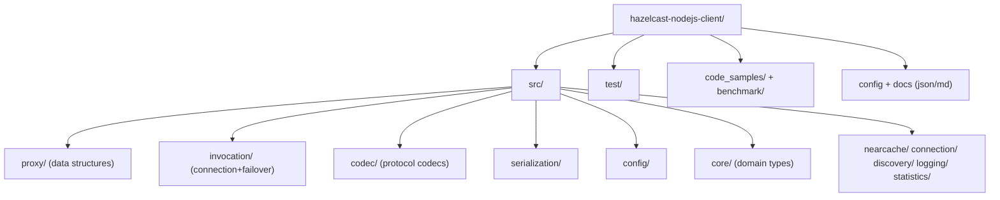
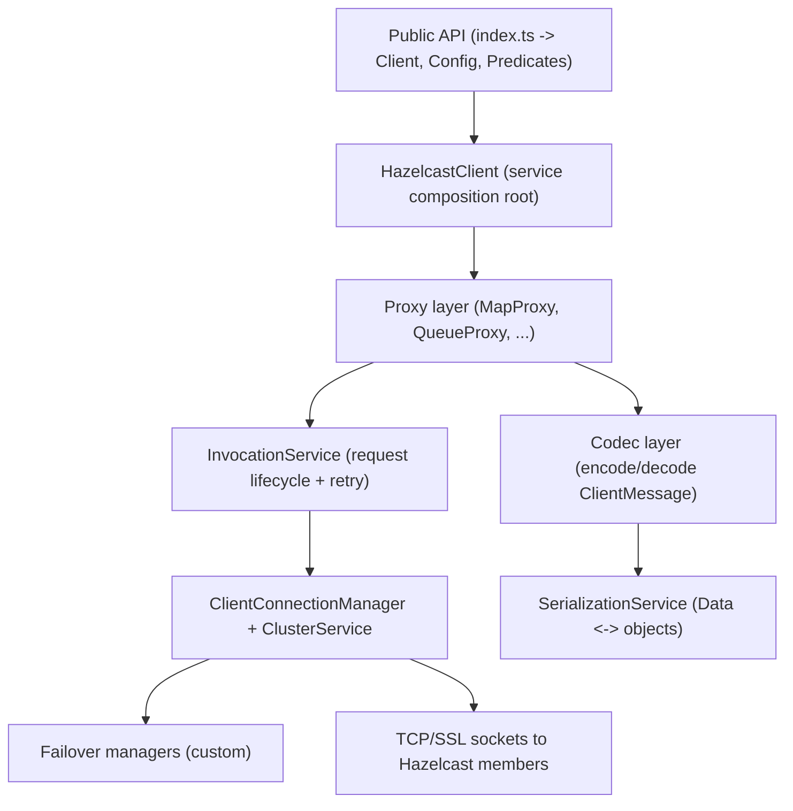
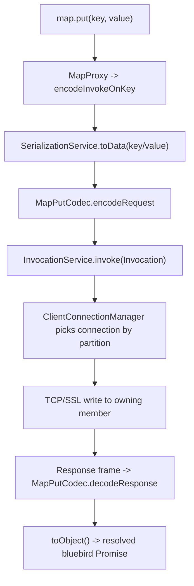

<!-- Generated: 2026-06-11 | commits: 781 | branch: 3.12.x -->
<!-- Regenerate: run /csdlc-map and choose "Regenerate" -->

# Codebase Map — @celerispay/hazelcast-client

> **Project context document.** Load this file at the start of any session for immediate project orientation. Contains stack, conventions, architecture, data flow, and key patterns — no pipeline required.

---

## Project Summary

This is a **fork of the official Hazelcast Node.js client** (`@celerispay/hazelcast-client`, v3.12.7-6) — a client library that lets Node.js applications talk to a Hazelcast IMDG (in-memory data grid) cluster over the Hazelcast Open Binary Client Protocol. It exposes distributed data structures (Map, Set, Queue, MultiMap, List, Ringbuffer, Topic, ReplicatedMap), concurrency primitives (Lock, Semaphore, AtomicLong), ID generators (FlakeIdGenerator, PNCounter), and supporting services (Near Cache, client statistics, lifecycle/cluster events) behind a Promise-based API.

The fork's distinguishing purpose — visible in recent commit history and the `src/invocation/` additions — is a set of **critical connection-failover fixes** for single-node restart and multi-node reconnect scenarios: TCP-probe reconnect loops, owner-connection restoration, credential preservation across restarts, connection blocklist management, and smart retry classification. Vanilla upstream behavior was replaced with these custom managers.

**Status:** maintenance fork with active failover hardening (3.x line; upstream 4.x support not present)
**Type:** library / SDK (npm-published TypeScript client)

---

## Quick Start

```bash
# Install
npm install

# Build (TypeScript -> lib/)
npm run compile        # alias: npm run build

# Lint
npm run lint           # tslint --project tsconfig.json

# Test (requires a running Hazelcast remote-controller + JVM cluster)
npm test               # mocha --recursive ; pretest downloads remote-controller

# Coverage
npm run coverage       # istanbul over lib/ via mocha

# Generate API docs
npm run generate-docs  # typedoc -> docs/ (excludes codec/)
```

**Prerequisites:** Node.js (devDeps pin `@types/node` 8.0.0), a JVM, and a reachable **Hazelcast IMDG 3.x cluster**. Tests spin up real members via `hazelcast-remote-controller` on `localhost:9701` (`test/RC.js`) — they are integration tests, not pure unit tests, so a JVM + controller jar is mandatory (`pretest` runs `download-remote-controller.js`).

---

## Tech Stack

| Layer | Technology |
|-------|-----------|
| Language | TypeScript 2.8.4 (compiled to ES5, CommonJS modules) |
| Runtime | Node.js (CommonJS; `main` = `./lib/index.js`, typings = `./lib/index`) |
| Async model | `bluebird` Promises (imported as `import * as Promise from 'bluebird'` throughout) |
| 64-bit ints | `long` (Java long interop for IDs, partition data) |
| Buffers | `safe-buffer` |
| Wire protocol | Hazelcast Open Binary Client Protocol (hand-written + generated codecs) |
| Build tool | `tsc` (no bundler) |
| Linter | `tslint` 5.7.0 (`tslint.json`) |
| Test framework | `mocha` 3.2.0 + `chai` (expect) + `sinon` 4.0.0 |
| Coverage | `istanbul` + `remap-istanbul` (cobertura + html) |
| Docs | `typedoc` 0.16.11 |
| Test infra | `hazelcast-remote-controller` (drives real JVM cluster members) |

**Key runtime dependencies:**
- `bluebird` ^3.7.2 — the Promise implementation the entire async surface is built on.
- `long` ^4.0.0 — represents Java 64-bit longs (partition IDs, flake IDs, counters).
- `safe-buffer` ^5.2.1 — safe Buffer allocation for protocol frame encoding.

**Key dev dependencies:**
- `mocha` / `chai` / `sinon` — test runner, assertions, mocks/stubs.
- `tslint` — style + correctness linting against `tsconfig.json`.
- `typedoc` — public API documentation generation.
- `istanbul` / `remap-istanbul` — coverage collection and source-map remap to TS.

---

## Directory Structure



**Directory roles:**

| Directory | Classification | Contents |
|-----------|---------------|---------|
| `src/` | source | 406 `.ts` files; library implementation |
| `src/codec/` | source | 245 protocol request/response codecs (mostly generated; the bulk of the file count) |
| `src/proxy/` | source | 38 files — client-side proxies for each distributed data structure |
| `src/invocation/` | source | 13 files — connection management, cluster service, retry, **custom failover** |
| `src/serialization/` | source | 18 files — object<->binary `Data`, portable, default serializers |
| `src/config/` | source | 19 files — declarative/programmatic client configuration |
| `src/core/` | source | 22 files — domain types, listeners, predicates, `Member`, `UUID` |
| `src/nearcache/` | source | 10 files — local near-cache and invalidation repair |
| `src/connection/` | source | address providers/translators, SSL options |
| `src/discovery/` | source | Hazelcast Cloud address discovery + translation |
| `src/logging/`, `src/statistics/` | source | logging service, client statistics reporting |
| `test/` | tests | 110 `.js` integration tests grouped by feature (`map/`, `lock/`, ...) |
| `code_samples/`, `benchmark/` | docs/perf | usage examples and throughput benchmarks |
| root `*.md`, `*.json` | config/docs | `DOCUMENTATION.md`, `CONFIG.md`, `FAILOVER_FIXES.md`, `config-schema.json`, sample client JSON |

---

## Architecture



**Layer responsibilities:**
- **Public API (`src/index.ts`):** the only export surface. Re-exports `HazelcastClient` as `Client`, plus `Config`, `Predicates`, `Aggregators`, error classes, and event/enum types. Nothing else should be imported by consumers.
- **HazelcastClient:** composition root. Its constructor instantiates and wires every service (logging, serialization, invocation, listener, connection manager, partition/cluster service, lifecycle, proxy manager, near-cache manager, heartbeat, statistics). `newHazelcastClient()` is the entry factory.
- **Proxy layer (`src/proxy/`):** one proxy class per distributed structure, all extending `BaseProxy`. Translates high-level calls (`map.put`) into codec-encoded requests and invokes them. `NearCachedMapProxy` decorates `MapProxy` with near-cache reads.
- **Invocation (`src/invocation/`):** `InvocationService` owns the request/response lifecycle, deadlines, and retry. `ClientConnectionManager` opens/authenticates/retries connections; `ClusterService` tracks membership; custom failover managers handle reconnect.
- **Codec (`src/codec/`):** stateless encode/decode of `ClientMessage` frames for every server operation. Generated — do not hand-edit unless protocol changes.
- **Serialization (`src/serialization/`):** converts JS objects to/from binary `Data` (`HeapData`, `ObjectData`), including Portable and default serializers.

---

## Modules

| Module | Purpose | Key exports / files |
|--------|---------|-------------------|
| `proxy` | Client-side handles for distributed data structures | `BaseProxy.ts`, `MapProxy.ts`, `ProxyManager.ts`, `NearCachedMapProxy.ts` |
| `invocation` | Connection lifecycle, request invocation, retry, failover | `InvocationService.ts`, `ClientConnectionManager.ts`, `ClusterService.ts`, `ClientConnection.ts` |
| `invocation` (failover) | **Custom** reconnect/resilience layer | `HazelcastFailoverManager.ts`, `SmartRetryManager.ts`, `NodeReadinessDetector.ts`, `CredentialPreservationService.ts`, `ConnectionPoolManager.ts` |
| `codec` | Binary protocol encode/decode | 245 `*Codec.ts` (e.g. `ClientGetDistributedObjectsCodec.ts`) |
| `serialization` | Object<->binary conversion | `SerializationService.ts`, `ObjectData.ts`, `HeapData.ts`, `portable/` |
| `config` | Declarative + programmatic configuration | `Config.ts`, `ConfigBuilder.ts`, `ClientNetworkConfig.ts`, `Properties.ts`, `SSLConfig.ts` |
| `core` | Domain types, listeners, predicates | `Predicate.ts`, `Member.ts`, `UUID.ts`, `EntryListener.ts`, `HazelcastJsonValue.ts` |
| `nearcache` | Local cache of map entries + invalidation | `NearCacheManager.ts`, `RepairingTask.ts` |
| `connection` | Address resolution + SSL | `DefaultAddressProvider.ts`, `DefaultAddressTranslator.ts`, `BasicSSLOptionsFactory.ts` |
| `discovery` | Hazelcast Cloud member discovery | `HazelcastCloudAddressProvider.ts`, `HazelcastCloudDiscovery.ts` |
| `logging` / `statistics` | Pluggable logging, client metrics push | `LoggingService.ts`, `ILogger.ts`, `Statistics.ts` |

---

## Key Files

| File | Role | Notes |
|------|------|-------|
| `src/index.ts` | Public entry | Defines the entire export surface; `Client = HazelcastClient` |
| `src/HazelcastClient.ts` | Composition root | Wires all services; `newHazelcastClient()` factory + `init()` |
| `src/proxy/BaseProxy.ts` | Proxy base class | `encodeInvoke*` helpers; all proxies extend this |
| `src/proxy/MapProxy.ts` | Largest proxy (708 lines) | Full IMap implementation; primary feature surface |
| `src/proxy/ProxyManager.ts` | Proxy registry | Maps service names (`hz:impl:mapService`, etc.) to proxy classes |
| `src/invocation/InvocationService.ts` | Request lifecycle | `Invocation` class, deadlines, retry pause, clean-resources task |
| `src/invocation/ClientConnectionManager.ts` | Connection lifecycle (833 lines) | `getOrConnect`, `retryConnection`, `authenticate` |
| `src/invocation/ClusterService.ts` | Membership (1169 lines, largest) | Member list, owner connection, partition events |
| `src/invocation/HazelcastFailoverManager.ts` | **Custom failover** | `NodeState` machine (owner/child/disconnected/failed) |
| `src/invocation/SmartRetryManager.ts` | **Custom retry** | Classifies errors (auth/network/node_startup/temporary/permanent) |
| `src/invocation/NodeReadinessDetector.ts` | **Custom TCP probe** | Uses `net` sockets to detect node readiness before reconnect |
| `src/serialization/SerializationService.ts` | Serialization root | `SerializationServiceV1`; object<->`Data` |
| `src/config/ConfigBuilder.ts` | Declarative config loader | Loads JSON config, validates against schema |
| `src/config/Properties.ts` | Property defaults | All `hazelcast.client.*` tunables and defaults |
| `test/RC.js` | Test harness | Wraps `hazelcast-remote-controller`; creates/starts JVM clusters |

---

## Data Flow



**Flow narrative:** A proxy call serializes its arguments to binary `Data`, encodes a `ClientMessage` via the matching codec, and hands an `Invocation` to `InvocationService`. The service resolves the target connection (by partition ID for partition-aware ops, or owner connection otherwise) through `ClientConnectionManager`, writes the frame to a member socket, and resolves a bluebird Promise when the decoded response returns. On `RetryableHazelcastError`, `TargetDisconnectedError`, or `IOError`, the invocation is retried until its deadline; reconnect/failover is mediated by the custom failover managers.

---

## Conventions & Patterns

These are the patterns observed in the codebase. Follow them when writing new code.

**Naming:**
- Files: `PascalCase.ts` matching the primary exported class (`MapProxy.ts`, `ClusterService.ts`).
- Classes / interfaces / enums: `PascalCase`. Interfaces are NOT `I`-prefixed for services (`ILogger` is an exception; data-structure public interfaces use `I`-prefix: `IMap`, `IQueue`, `ILock`).
- Methods / variables: `camelCase`. Private fields use `readonly` heavily in service constructors.
- Constants: `UPPER_SNAKE_CASE` module-level consts (`MAX_FAST_INVOCATION_COUNT`, `PROPERTY_INVOCATION_TIMEOUT_MILLIS`).
- Tests: `*Test.js` co-located by feature folder (`test/map/MapProxyTest.js`).

**Architecture patterns:**
- **Composition root:** `HazelcastClient` constructor builds the full object graph; services receive the client (`new InvocationService(this)`) for back-references. No DI container — manual wiring.
- **Proxy pattern:** every distributed structure is a `BaseProxy` subclass; `ProxyManager` maps server service names to proxy constructors.
- **Codec pattern:** one stateless codec module per protocol operation; encode/decode only, no business logic.
- **Decorator:** `NearCachedMapProxy` wraps `MapProxy` to add near-cache read-through.
- **State machine:** `HazelcastFailoverManager.NodeState` and `NodeReadinessDetector.NodeReadinessStatus` model reconnect lifecycle explicitly via enums.

**Code style observations:**
- Async: **bluebird Promises everywhere** (`import * as Promise from 'bluebird'`) — not native Promises, not async/await. `DeferredPromise()` helper from `src/Util.ts` is the standard resolver pattern. New async code must stay bluebird-consistent.
- Error handling: typed error classes in `src/HazelcastError.ts` (`RetryableHazelcastError`, `TargetDisconnectedError`, `IOError`, `ClientNotActiveError`, ...). Retry decisions branch on error type, never on string matching.
- Module imports: mixes ES import (`import {X} from`) with TS `import X = require('./X')` for default-export-as-module files (`Address`, `ClientMessage`). Follow the existing form per file.
- Logging: always via `ILogger` / `LoggingService` — never `console.log`.
- License header: every `src/*.ts` file begins with the Apache 2.0 copyright block.

**Things to avoid** (anti-patterns relative to this codebase):
- Do not introduce native `async/await` or native `Promise` in `src/` — it breaks bluebird-specific behavior (e.g. `.Resolver`, cancellation) used by the invocation layer.
- Do not hand-edit `src/codec/**` — codecs are generated against the binary protocol.
- Do not bypass `ProxyManager` to construct proxies directly in consumer code.

---

## Configuration & Environment

**Process environment variables:** the client library itself reads **no `process.env` variables** (config flows through `ClientConfig` / declarative JSON). Environment variables appear only in the **test harness**:

| Variable | Purpose | Required | Default |
|----------|---------|---------|---------|
| `HAZELCAST_ENTERPRISE_KEY` | Enterprise license for enterprise-feature tests (SSL, etc.) | No (only enterprise tests) | none |
| `HZ_TYPE` / `SERVER_TYPE` | Selects server flavor (OSS vs enterprise) in tests | No | OSS |

**Client tunables (`hazelcast.client.*` properties in `src/config/Properties.ts`):** set programmatically via `ClientConfig.properties` or declarative JSON — names only:
`hazelcast.client.invocation.timeout.millis`, `...invocation.max.retries`, `...invocation.retry.pause.millis`, `...heartbeat.interval`, `...heartbeat.timeout`, `...connection.max.retries`, `...connection.retry.delay`, `...connection.health.check.interval`, `...failover.cooldown`, `...partition.failure.backoff`, `...partition.refresh.min.interval`, `...statistics.enabled`, `...statistics.period.seconds`, `...autopipelining.enabled`, `...autopipelining.threshold.bytes`, `...socket.no.delay`, `...cloud.url`, `...internal.clean.resources.millis`, `hazelcast.logging.level`, and `hazelcast.invalidation.*` near-cache reconciliation keys.

**Config files (repo root):** `hazelcast-client-default.json`, `hazelcast-client-full.json` (sample declarative configs), `config-schema.json` (JSON schema for validation), `CONFIG.md` (reference).

---

## External Integrations

| Service | Type | Purpose | Config key |
|---------|------|---------|-----------|
| Hazelcast IMDG cluster (3.x) | TCP / binary protocol | The data grid the client talks to | `networkConfig.addresses` |
| Hazelcast Cloud | discovery API | Resolve member addresses for managed clusters | `cloudConfig` / `hazelcast.client.cloud.url` |
| TLS/SSL | transport security | Optional encrypted member connections | `SSLConfig` / `BasicSSLOptionsFactory` |
| `hazelcast-remote-controller` | test infra (JVM RPC) | Spins up real cluster members for integration tests | `localhost:9701` in `test/RC.js` |

No database, message queue, or auth provider beyond the cluster's own group credential authentication (`ConnectionAuthenticator`, `GroupConfig`).

---

## Test Strategy

- **Framework:** `mocha` 3.2.0 + `chai` (`expect`) + `sinon` (stubs/mocks).
- **Test location:** `test/` (110 `.js` files), grouped by feature folder — `map/`, `lock/`, `queue/`, `nearcache/`, `serialization/`, `ssl/`, `connection/`, `statistics/`, etc.
- **Run command:** `npm test` (`mocha --recursive`, JUnit XML reporter). `pretest` downloads the remote-controller jar.
- **Coverage command:** `npm run coverage` (istanbul over compiled `lib/`, remapped to TS via `remap-istanbul`; cobertura + html output).
- **Test types present:** predominantly **integration** — tests provision a real JVM Hazelcast cluster via `hazelcast-remote-controller` (`test/RC.js`) and exercise the live binary protocol. Some serialization/predicate tests are effectively unit-level.
- **Mocking approach:** `sinon` for spies/stubs of internal services; real cluster members for end-to-end paths. There is no in-memory fake of the cluster.
- **Test data:** inline fixtures per test file; helper utilities in `test/Util.js` and factories like `test/javaclasses/`.

---

## Concerns

- **[fragile]** `src/invocation/ClusterService.ts` — 1169 lines, the largest file; central to membership + partition routing and high-churn in failover work. High blast radius.
- **[fragile]** `src/invocation/ClientConnectionManager.ts` — 833 lines; connection/auth/retry hot path; recent commits repeatedly touch blocklist/owner-connection logic (single-node restart bugs).
- **[debt]** Custom failover managers (`HazelcastFailoverManager`, `SmartRetryManager`, `NodeReadinessDetector`, `CredentialPreservationService`, `ConnectionPoolManager`) are a fork-specific layer **diverging from upstream** — no upstream parity, merge/rebase risk, and `FAILOVER_FIXES.md` is the only design doc.
- **[debt]** Toolchain is dated: TypeScript 2.8.4, `@types/node` 8.0.0, mocha 3.2.0, tslint (deprecated). Targets ES5; bluebird instead of native Promises.
- **[untested-ish]** Tests require a JVM + remote-controller and a live cluster — they cannot run in a plain CI container without that infra, so local fast feedback is limited.
- **[fragile]** `src/codec/**` (245 generated files) must not be hand-edited; protocol changes require regeneration tooling not present in this repo.

---

## Open Questions

- The codec generation tooling/source is not in this repo — how are `src/codec/*` regenerated when the binary protocol changes? (Likely an external Hazelcast generator.)
- `FAILOVER_FIXES.md`, `HAZELCAST_CLIENT_EVOLUTION.md`, and `RELEASE_SUMMARY.md` exist at root but were not deeply read here — they likely hold the authoritative rationale for the custom failover layer.
- npm package is named `@celerispay/hazelcast-client` but README/repo links still point to upstream `hazelcast/hazelcast-nodejs-client` — publishing target and divergence policy from upstream is unclear.
- No CI config (`.github/`, etc.) was detected in the root listing — how integration tests run in automation (with the JVM cluster requirement) is unknown.
